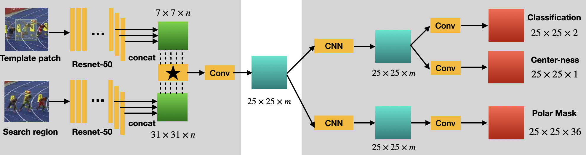
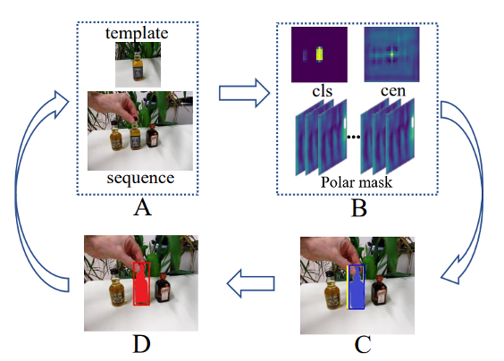
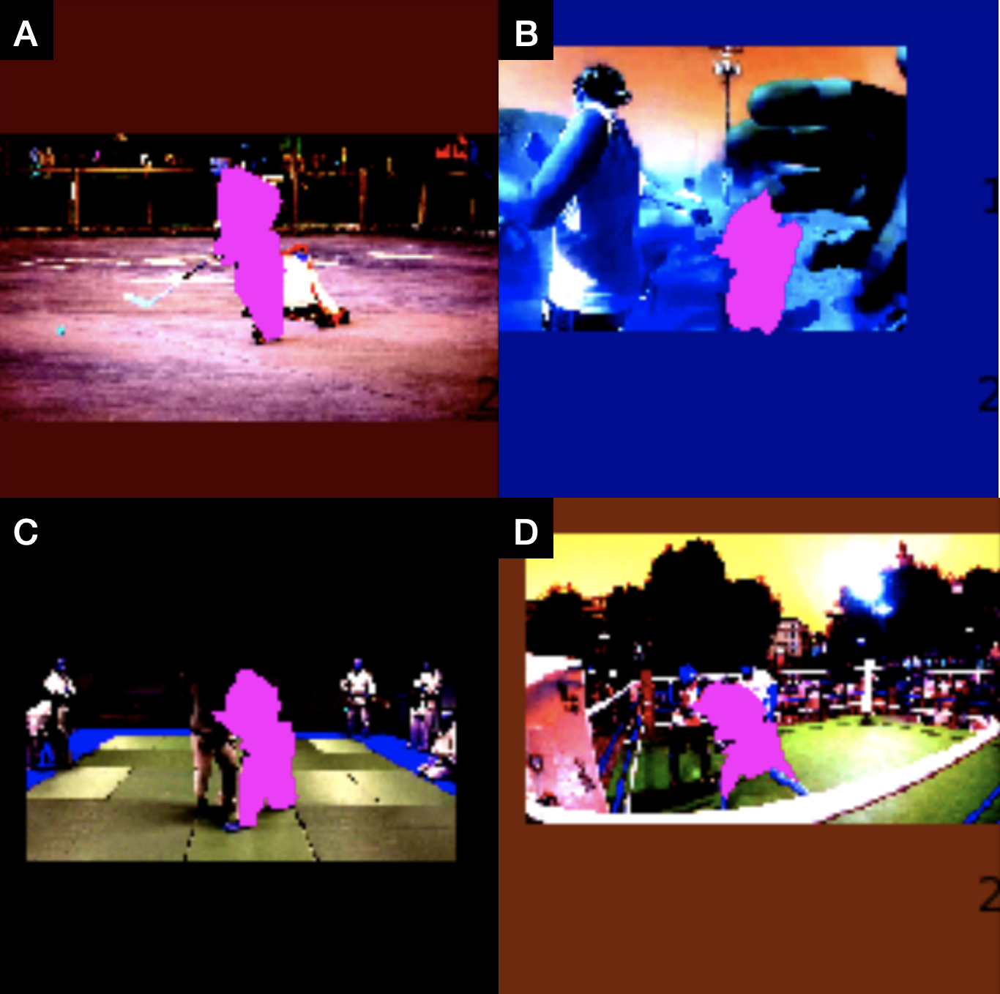
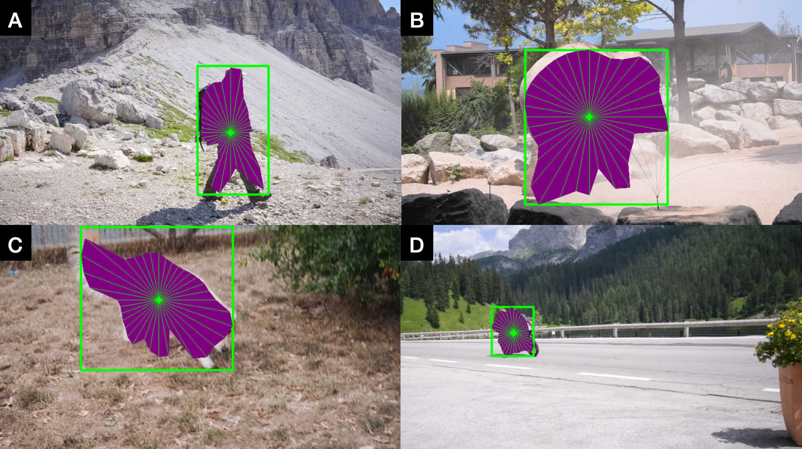
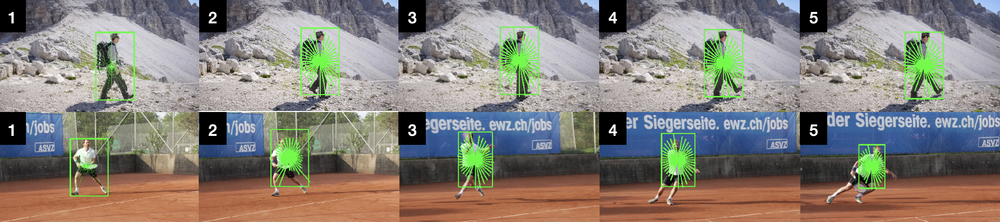

# SiamPolarMask
This is a pytorch implementation of Siam Polar Mask, which is a mixed model of Siam Car and Polar Mask, for more details, please visit:  
1. [Polar Mask (CVPR 2020)](https://arxiv.org/abs/1909.13226), [Source Code](https://github.com/xieenze/PolarMask) 
2. [Siam Car (CVPR 2020, Oral)](https://arxiv.org/abs/1911.07241), [Source Code](https://github.com/ohhhyeahhh/SiamCAR) 
3. [Siam Mask (CVPR 2019)](https://arxiv.org/abs/1812.05050), [Source Code](https://github.com/foolwood/SiamMask) 

## Proposed Model
We propose a neural network consisting of two parts: one Siamese subnetwork for feature extraction and one classification-mask subnetwork for polar mask prediction. We will first use resnet-50 as backbone, and the network architecture is shown below.
### Network Architecture
The "star" in the figure below denotes the depth-wise cross correlation.

### Polar Representation
Instead of using pixel level mask (like mask-rcnn), we represent the mask by one center and 36 rays with the same angle interval (10 degrees) in Polar coordinate, as shown below. Since the angle interval is pre-defined, only the length of the ray needs to be predicted. Therefore, we formulate the instance segmentation as instance center classification and dense distance regression in a Polar coordinate.

## How to run
### If using shell:  
To run the shell file: `/bin/bash run_my_code.sh` 
You can edit the shell by:
`python3 train.py --batch [the batch size] --lr [learning rate] --epochs [# of epochs] --continue_train [continue training]`
### If using IDE:  
Click on "run" !

## Training Dataset
1. [MS COCO](http://cocodataset.org/#home)  
2. [DAVIS](https://davischallenge.org)  
## Tracking Process
Sub-figure A shows a pair of inputs while Sub-figure B shows the corresponding outputs of the model. From Sub-figure B we can observe that the outputs of the model can depict good prediction for different attributes of the object. Sub-figure C shows the predicted bounding boxes and masks cor- responding to this frame and last frame. Sub-figure D shows the final predicted bounding box and mask by averaging those boxes and masks in C.

## Results
### Detection and Segmentation on MS COCO
Our model can successfully detect and segment the object on MS COCO if given a single image.

### Detection and Segmentation on DAVIS
Our model can successfully detect and segment the object on DAVIS if given a single image.

### Tracking and Segmentation on DAVIS
This is a very challenging task, our model can successfully track the object in some videos (frames 1-5 at the top), but fails in some other videos (frames 1-5 at the bottom).

